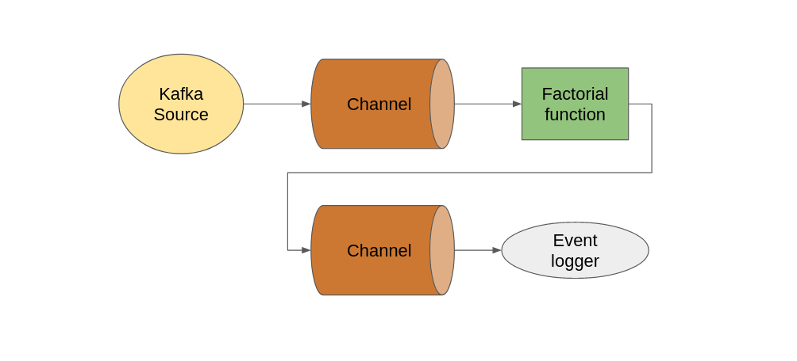

# Knative Serverless talk example

## Flow description

## Functions

* [Event logger](https://github.com/knative/eventing-contrib/blob/master/cmd/event_display/main.go)
* [Factorial function](rust-factorial-function/src/main.rs)

